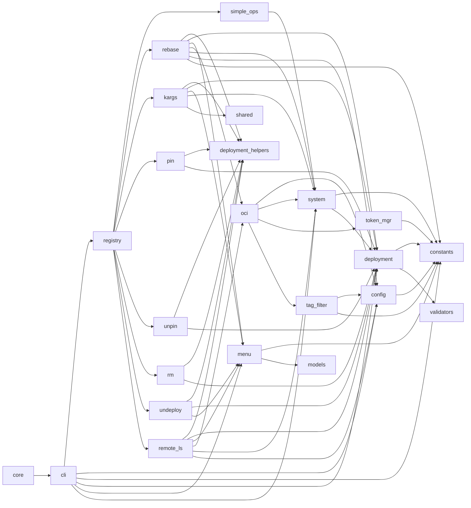
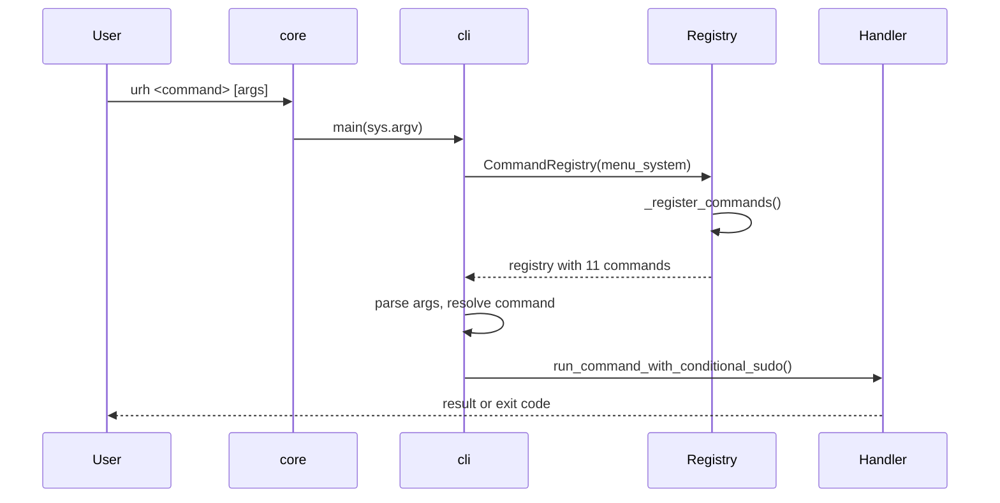
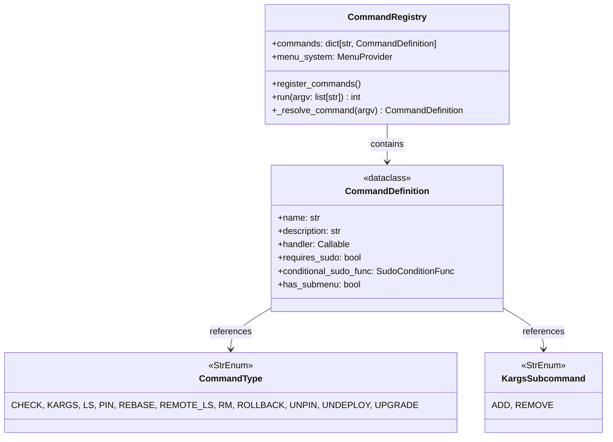
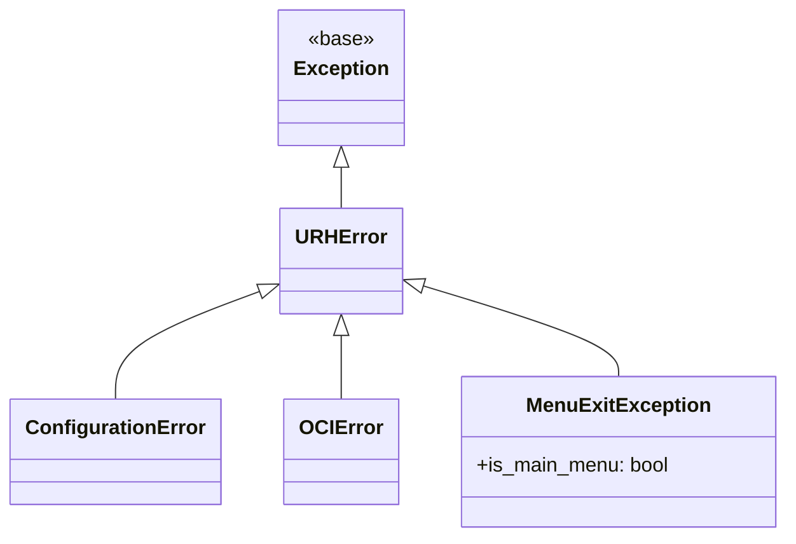

# ublue-rebase-helper (urh) — Code Navigation Map

> rpm-ostree wrapper with interactive gum UI. Rebase, upgrade, rollback, pin/unpin, kargs, OCI tag browsing.

## File Index

```
src/urh/
├── core.py                  # entry → cli.main()
├── cli.py                   # arg parse, dep check, menu loop, dispatch
├── constants.py             # leaf: version, paths, prefixes, env vars
├── models.py                # leaf: MenuItem, ListItem, GumCommand
├── validators.py            # leaf: is_valid_deployment_info() TypeGuard
├── config.py                # URHConfig, RepositoryConfig, ConfigManager, get_config()
├── system.py                # _run_command(execvp), build_command, is_running_as_root, URL helpers
├── deployment.py            # parse rpm-ostree status → DeploymentInfo[], TagContext enum
├── menu.py                  # MenuSystem(gum→text), MenuExitException, get_user_input()
├── token_manager.py         # OCITokenManager: GHCR OAuth2 token + /tmp cache
├── tag_filter.py            # OCITagFilter: filter/sort/dedup OCI tags
├── oci_client.py            # OCIClient: paginated GHCR tag fetch via curl
└── commands/
    ├── registry.py           # CommandRegistry: wires 11 commands
    ├── shared.py             # CommandDefinition, CommandType/KargsSubcommand enums
    ├── deployment_helpers.py # select_deployment(), handle_deployment_command()
    ├── simple_ops.py         # check, ls, upgrade, rollback
    ├── rebase.py             # resolve_tag_to_full_url(), handle_rebase()
    ├── kargs.py              # show/append/delete/replace, should_use_sudo_for_kargs()
    ├── remote_ls.py          # handle_remote_ls()
    ├── pin.py                # handle_pin()
    ├── unpin.py              # handle_unpin()
    ├── rm.py                 # handle_rm()
    └── undeploy.py           # handle_undeploy() + Y/N confirmation
```

## Dependency Graph



## Entry Point Flow



## Command Dispatch

| Command     | Handler                      | Sudo    | Flow                                                         |
| ----------- | ---------------------------- | ------- | ------------------------------------------------------------ |
| `check`     | `simple_ops.handle_check`    | no      | `rpm-ostree upgrade --check`                                 |
| `ls`        | `simple_ops.handle_ls`       | no      | `rpm-ostree status -v`                                       |
| `upgrade`   | `simple_ops.handle_upgrade`  | yes     | `rpm-ostree upgrade`                                         |
| `rollback`  | `simple_ops.handle_rollback` | yes     | `rpm-ostree rollback`                                        |
| `rebase`    | `rebase.handle_rebase`       | yes     | menu/arg → `resolve_tag_to_full_url()` → `rpm-ostree rebase` |
| `kargs`     | `kargs.handle_kargs`         | dynamic | submenu or subcommand → `rpm-ostree kargs`                   |
| `remote-ls` | `remote_ls.handle_remote_ls` | no      | menu/arg → `OCIClient.fetch_repository_tags()` → print       |
| `pin`       | `pin.handle_pin`             | yes     | `handle_deployment_command(ostree admin pin)`                |
| `unpin`     | `unpin.handle_unpin`         | yes     | `handle_deployment_command(ostree admin pin -u)`             |
| `rm`        | `rm.handle_rm`               | yes     | `handle_deployment_command(ostree admin undeploy)`           |
| `undeploy`  | `undeploy.handle_undeploy`   | yes     | same as rm + Y/N confirmation                                |

## Command Registry



**11 commands:** check, kargs, ls, pin, rebase, remote-ls, rm, rollback, unpin, undeploy, upgrade.

**Sudo:** static `requires_sudo=True/False` or dynamic `conditional_sudo_func(args)` (kargs).

## Dependency Injection

```mermaid
classDiagram
    class MenuProvider {
        <<Protocol>>
        +show_menu(items, header, persistent_header, is_main_menu) Any
    }

    class MenuSystem {
        +show_menu(...) Any
    }

    class CommandRegistry {
        +menu_system: MenuProvider
    }

    MenuProvider <|.. MenuSystem
    MenuProvider <|.. "Mock"
    CommandRegistry --> MenuProvider : depends on
```

Protocols have default implementations — production uses real objects, tests inject mocks.

## Key Patterns

### Lazy Imports (circular dep avoidance)

- `deployment.py` ↔ `system.py`: `TagContext` imported locally in `extract_context_from_url()`
- `oci_client.py`: `token_manager`/`tag_filter` imported inside `__init__`/`fetch_repository_tags()`
- `deployment.py`: `validators.is_valid_deployment_info` imported inside `format_deployment_header()`

### Configuration

```
pyproject.toml version → injected into constants.__version__ at build
~/.config/urh.toml      → ConfigManager.load_config() → URHConfig
```

Hardcoded `_STANDARD_REPOSITORIES` defaults always loaded; user TOML merges on top.

### Tag Resolution (`rebase`)

```
arg → parse_repo_and_tag() → resolve_short_tag() [OCI fetch if needed]
  → build_full_url() → ensure_ostree_prefix() → rpm-ostree rebase
```

Confirmation skipped when `-y`/`--yes`, explicit `repo:tag`, or full URL.

### Tag Filtering (`remote-ls`)

```
OCIClient.get_all_tags() → OCITokenManager.get_token() → curl pagination
  → OCITagFilter.filter_and_sort_tags()
    → context filter → pattern filter → ignore filter → transform → dedup → sort → limit
```

## Exception Hierarchy



## Data Models

```python
DeploymentInfo(deployment_index: int, is_current: bool, repository: str, version: str, is_pinned: bool)
MenuItem(key: str, description: str, value: Any)
ListItem(description: str, value: Any)  # extends MenuItem, no key prefix in display
GumCommand(options: List[str], header: str, persistent_header, cursor, selected_prefix, height, timeout)
CommandDefinition(name, description, handler, requires_sudo, conditional_sudo_func, has_submenu)
URHConfig(repositories: Dict, container_urls: ContainerURLsConfig, settings: SettingsConfig)
RepositoryConfig(include_sha256_tags, filter_patterns, ignore_tags, transform_patterns, latest_dot_handling, tags)
```

## Testing

| Dir                  | Scope                                                             |
| -------------------- | ----------------------------------------------------------------- |
| `tests/e2e/`         | Full command flows                                                |
| `tests/integration/` | Cross-module interactions                                         |
| `tests/conftest.py`  | Shared fixtures: subprocess mocks, deployment scenarios, DI mocks |

## Build

```
make build   → dist/urh.pyz (deterministic zipapp, SOURCE_DATE_EPOCH)
make install → ~/.local/bin/urh (symlink)
make test    → pytest --cov
make quality → ty (typecheck) + ruff (lint/format)
```

## External Dependencies

| Dependency   | Purpose                                     |
| ------------ | ------------------------------------------- |
| `rpm-ostree` | Core ostree operations                      |
| `ostree`     | Deployment pinning/undeploying              |
| `gum`        | Interactive menus (optional, text fallback) |
| `curl`       | OCI registry API (required)                 |
| Python 3.13+ | StrEnum, `Self`, `match`/`case`             |
