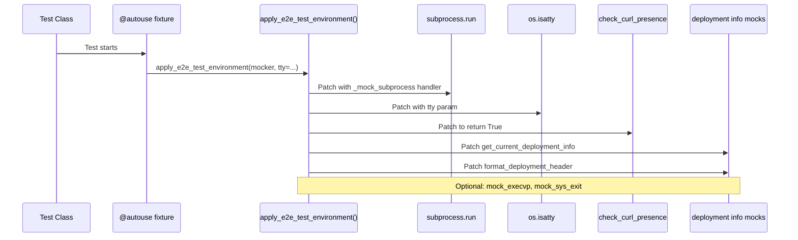
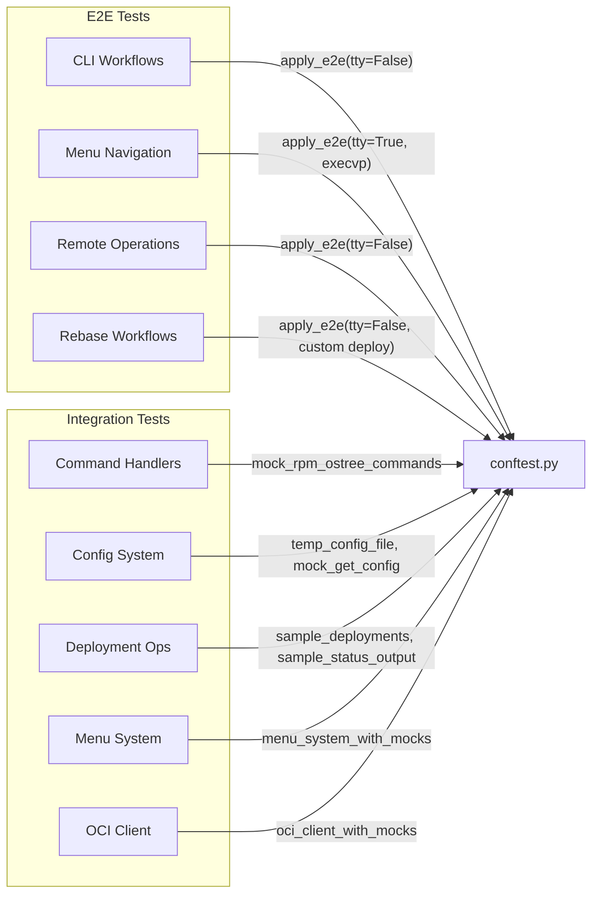
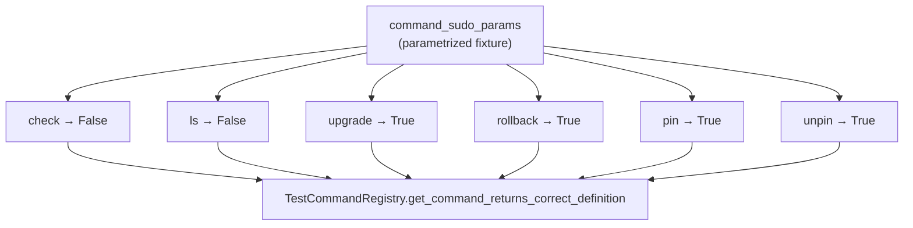

# Test Suite Design Guide

> **Design Philosophy:** E2E and integration tests only. Test user-facing functionality through the public API. Never mock the system-under-test (SUT).

---

## Table of Contents

- [Design Philosophy](#design-philosophy)
- [Test Organization](#test-organization)
- [Code Navigation Map](#code-navigation-map)
- [Fixture Dependency Graph](#fixture-dependency-graph)
- [What We Test](#what-we-test)
- [What We Avoid](#what-we-avoid)
- [Using Centralized Fixtures](#using-centralized-fixtures)
- [Mocking Guidelines](#mocking-guidelines)
- [Test Structure Patterns](#test-structure-patterns)

---

## Design Philosophy

### Core Principles

1. **E2E/Integration-First**: Test user-facing workflows end-to-end. Every test should verify observable behavior that a user would experience.

2. **Never Mock the SUT**: Mock only external I/O boundaries (subprocess, network, filesystem). Test actual application logic.

3. **Dependency Injection**: Use DI to isolate external dependencies without mocking business logic. Refactor source code as needed to enable injection points.

4. **Pytest Best Practices**: Leverage parametrization, fixture injection, and centralized fixtures. Avoid unittest patterns.

### What This Means

```python
# ✅ CORRECT: Test through public API, mock only external I/O
def test_check_command_executes_rpm_ostree(mocker):
    mock_run = mocker.patch("subprocess.run")
    mock_run.return_value = mocker.MagicMock(returncode=0)

    cli_main()  # Test actual CLI entry point

    mock_run.assert_called_with(["rpm-ostree", "upgrade", "--check"])

# ❌ WRONG: Mocking the SUT (command handler)
def test_check_command(mocker):
    mock_handler = mocker.patch("src.urh.commands.CommandRegistry._handle_check")
    # This tests nothing useful - we mocked what we should test!
```

---

## Test Organization

```
tests/
├── conftest.py              # Centralized fixtures (session/module/function)
├── e2e/                     # End-to-end workflow tests
│   ├── test_cli_workflows.py    # CLI entry point + command execution
│   ├── test_menu_navigation.py  # Menu system + command selection
│   ├── test_remote_operations.py # OCI client + tag filtering
│   └── test_rebase_workflows.py  # Rebase tag resolution, confirmation, custom repos
└── integration/             # Integration tests (module interactions)
    ├── test_command_handlers.py # Command registry + handlers
    ├── test_config_system.py    # Config loading + validation
    ├── test_deployment_ops.py   # Deployment info + menu integration
    ├── test_menu_system.py      # Menu system logic (TTY/non-TTY)
    └── test_oci_client.py       # OCI client HTTP/pagination/auth logic
```

### E2E Tests (`e2e/`)

- Test complete user workflows
- Start from `cli_main()` or menu entry points
- Mock only: `subprocess.run`, network calls, file I/O
- Verify: exit codes, printed output, subprocess calls

### Integration Tests (`integration/`)

- Test module interactions
- Start from specific components (CommandRegistry, ConfigManager, etc.)
- Mock only: external dependencies of that component
- Verify: component behavior and interactions

---

## Code Navigation Map

### Test File Index

| File                                   | Tests | Classes                                                                                                                                                                                      | Focus                                                                       |
| -------------------------------------- | ----- | -------------------------------------------------------------------------------------------------------------------------------------------------------------------------------------------- | --------------------------------------------------------------------------- |
| `e2e/test_cli_workflows.py`            | 18    | `TestCLIDirectCommandExecution`, `TestCLIErrorHandling`, `TestCLIArgumentParsing`                                                                                                            | Direct CLI commands, error handling, arg parsing                            |
| `e2e/test_menu_navigation.py`          | 18    | `TestMainMenuNavigation`, `TestSubmenuNavigation`, `TestDeploymentSelectionMenus`, `TestMenuHeaderDisplay`                                                                                   | Menu workflows, ESC handling, deployment selection                          |
| `e2e/test_remote_operations.py`        | 9     | `TestRemoteLsCommand`, `TestOCIClientIntegration`, `TestTokenManagerIntegration`                                                                                                             | OCI remote-ls workflows, token caching                                      |
| `e2e/test_rebase_workflows.py`         | 25    | `TestRebaseTagResolution`, `TestRebaseRepoSuffix`, `TestRebaseConfirmation`, `TestRebaseCustomRepository`                                                                                    | Tag resolution, repo suffix syntax, confirmation prompts, -y flag           |
| `integration/test_command_handlers.py` | 44    | `TestCommandRegistry`, `TestSimpleCommandHandlers`, `TestKargsCommand`, `TestRebaseCommand`, `TestRemoteLsCommand`, `TestDeploymentCommands`                                                 | Registry, kargs subcommands, rebase/remote-ls handlers, deployment commands |
| `integration/test_config_system.py`    | 33    | `TestURHConfigDefaults`, `TestRepositoryConfigValidation`, `TestSettingsConfigValidation`, `TestConfigManagerLoading`, `TestConfigParsing`, `TestCreateDefaultConfig`, `TestGlobalGetConfig` | Config defaults, validation, TOML parsing, serialization                    |
| `integration/test_deployment_ops.py`   | 21    | `TestParseDeploymentInfo`, `TestGetCurrentDeploymentInfo`, `TestGetDeploymentInfo`, `TestFormatDeploymentHeader`, `TestCommandRegistryDeploymentHelpers`, `TestDeploymentInfoDataclass`      | Parsing rpm-ostree output, pin/unpin state, menu items                      |
| `integration/test_menu_system.py`      | 18    | `TestGumCommand`, `TestMenuSystemNonTTY`, `TestMenuSystemTextMenu`, `TestMenuSystemGumMenu`, `TestMenuSystemESCHandling`                                                                     | Gum command building, TTY/non-TTY modes, ESC handling                       |
| `integration/test_oci_client.py`       | 22    | `TestOCIClientHTTPResponseParsing`, `TestOCIClientPagination`, `TestOCIClientAuthHandling`, `TestOCIClientJSONParsing`, `TestOCIClientTagFiltering`                                          | HTTP parsing, pagination, auth retries, JSON, tag filtering                 |

**Total: 208 tests (59 E2E + 149 Integration)**

### Class Dependency Quick Reference

```
TestCLIDirectCommandExecution  ──uses──> apply_e2e_test_environment(tty=False)
TestCLIErrorHandling           ──uses──> apply_e2e_test_environment(tty=False)
TestCLIArgumentParsing         ──uses──> apply_e2e_test_environment(tty=False)
TestMainMenuNavigation         ──uses──> apply_e2e_test_environment(tty=True, mock_execvp=True)
TestSubmenuNavigation          ──uses──> apply_e2e_test_environment(tty=True, mock_execvp=True)
TestDeploymentSelectionMenus   ──uses──> apply_e2e_test_environment(tty=True, mock_execvp=True)
TestMenuHeaderDisplay          ──uses──> apply_e2e_test_environment(tty=True, mock_execvp=True)
TestRemoteLsCommand(e2e)       ──uses──> apply_e2e_test_environment(tty=False)
TestOCIClientIntegration       ──uses──> apply_e2e_test_environment(tty=False)
TestTokenManagerIntegration    ──uses──> apply_e2e_test_environment(tty=False)
TestRebaseTagResolution        ──uses──> apply_e2e_test_environment(tty=False, custom deployment_info)
TestRebaseRepoSuffix           ──uses──> apply_e2e_test_environment(tty=False, custom deployment_info)
TestRebaseConfirmation         ──uses──> apply_e2e_test_environment(tty=False)
TestRebaseCustomRepository     ──uses──> apply_e2e_test_environment(tty=False, custom deployment_info)
```

---

## Fixture Dependency Graph

### Fixture Hierarchy

```mermaid
graph TD
    subgraph Session["Session-Scoped (expensive, reused)"]
        SC1["sample_config_data"]
        SC2["sample_tags_data"]
        SC3["sample_status_output"]
        SC4["sample_deployments"]
        SC5["command_registry"]
    end

    subgraph Module["Module-Scoped (shared within file)"]
        MC1["mock_config_for_module_tests"]
        MC2["oci_client_with_mocks"]
        MC3["menu_system_with_mocks"]
    end

    subgraph Function["Function-Scoped (per-test)"]
        FC1["cli_command"]
        FC2["mock_rpm_ostree_commands"]
        FC3["command_sudo_params"]
    end

    subgraph Helpers["Shared Utilities"]
        H1["apply_e2e_test_environment"]
        H2["mock_execvp_command"]
        H3["_make_mock_process"]
    end

    SC3 --> SC4
    MC2 -.-> "subprocess.run"
    MC3 -.-> "os.isatty"
    H1 -.-> "subprocess.run"
    H1 -.-> "os.isatty"
    H1 -.-> "check_curl_presence"
    H2 -.-> H1
```

### E2E Test Setup Flow



### Fixture Usage by Test Category



### Parametrized Fixture Flow



---

## What We Test

### ✅ Test These

| Category                  | Examples                                                                                           |
| ------------------------- | -------------------------------------------------------------------------------------------------- |
| **CLI Entry Points**      | `cli_main()`, command-line argument parsing, menu navigation                                       |
| **Command Execution**     | All 11 commands (check, ls, upgrade, rollback, rebase, remote-ls, pin, unpin, rm, undeploy, kargs) |
| **Error Handling**        | Missing dependencies (curl), command failures, timeouts, invalid arguments                         |
| **Menu Workflows**        | Main menu → submenu navigation, ESC key handling, deployment selection                             |
| **Config System**         | TOML loading, validation, default values, repository-specific rules                                |
| **OCI Integration**       | Tag fetching, pagination, filtering, sorting, token caching                                        |
| **Deployment Operations** | Parsing rpm-ostree output, pin/unpin state, menu item generation                                   |
| **Rebase Workflows**      | Tag resolution, registry aliases, confirmation prompts, custom repos                               |

### Example Test Coverage

```python
# E2E: Complete workflow from CLI to subprocess
def test_rebase_command_with_url(mocker):
    """User runs: urh rebase ghcr.io/test/repo:tag"""
    mock_run = mocker.patch("subprocess.run")
    mock_run.side_effect = [
        mocker.MagicMock(returncode=0),  # curl check
        mocker.MagicMock(returncode=0),  # rebase command
    ]

    sys.argv = ["urh", "rebase", "ghcr.io/test/repo:tag"]
    cli_main()

    # Verify ostree prefix was added
    last_call = mock_run.call_args_list[-1][0][0]
    assert "ostree-image-signed:docker://ghcr.io/test/repo:tag" in last_call

# Integration: Command handler behavior
def test_kargs_conditional_sudo(mocker):
    """Kargs command: no args = no sudo, with args = sudo"""
    mock_run = mocker.patch("subprocess.run")

    registry = CommandRegistry()
    registry._handle_kargs([])  # No args
    registry._handle_kargs(["--append", "quiet"])  # With args

    calls = mock_run.call_args_list
    assert "sudo" not in calls[0][0][0]  # No sudo for no args
    assert "sudo" in calls[1][0][0]      # Sudo for modification args
```

---

## What We Avoid

### ❌ Don't Do These

| Anti-Pattern                                  | Why Avoid                                 | Better Alternative                                               |
| --------------------------------------------- | ----------------------------------------- | ---------------------------------------------------------------- |
| **Unit tests for pure functions**             | Tested indirectly through E2E/integration | Test `extract_repository_from_url()` through `remote-ls` command |
| **Mocking the SUT**                           | Defeats the purpose of testing            | Mock only external I/O (subprocess, network, files)              |
| **`with mocker.patch(...)` context managers** | Hard to scale, deep nesting               | Direct `mocker.patch()` at function top                          |
| **`unittest.mock` imports**                   | Inconsistent with pytest-mock             | Use `mocker.MagicMock()`, `mocker.patch()`                       |
| **`self.assertEqual()` style assertions**     | Unnecessary verbosity                     | Use plain `assert` statements                                    |
| **Testing implementation details**            | Brittle to refactoring                    | Test observable behavior only                                    |
| **Overlapping tests**                         | Wasted maintenance                        | Each test verifies one behavior                                  |

### Anti-Pattern Examples

```python
# ❌ WRONG: Unit test for pure function (test through integration instead)
def test_extract_repository_from_url():
    assert extract_repository_from_url("ghcr.io/user/repo:tag") == "user/repo"

# ✅ BETTER: Test through remote-ls command
def test_remote_ls_extracts_repository(mocker):
    mock_client = mocker.patch("src.urh.commands.OCIClient")
    sys.argv = ["urh", "remote-ls", "ghcr.io/user/repo:tag"]
    cli_main()
    mock_client.assert_called_once_with("user/repo")

# ❌ WRONG: Mocking the SUT
def test_command_registry(mocker):
    mock_handler = mocker.patch("src.urh.commands.CommandRegistry._handle_check")
    registry = CommandRegistry()
    registry.get_command("check").handler([])
    mock_handler.assert_called()  # Tests nothing!

# ✅ BETTER: Test actual command execution
def test_check_command(mocker):
    mock_run = mocker.patch("subprocess.run")
    sys.argv = ["urh", "check"]
    cli_main()
    mock_run.assert_called_with(["rpm-ostree", "upgrade", "--check"])

# ❌ WRONG: Context manager nesting (hard to scale)
def test_multiple_mocks(mocker):
    with mocker.patch("subprocess.run") as mock_run:
        with mocker.patch("sys.exit") as mock_exit:
            with mocker.patch("builtins.print") as mock_print:
                # Deep nesting...

# ✅ BETTER: Direct patching (scales well)
def test_multiple_mocks(mocker):
    mock_run = mocker.patch("subprocess.run")
    mock_exit = mocker.patch("sys.exit")
    mock_print = mocker.patch("builtins.print")
    # Flat structure, easy to add more mocks
```

---

## Using Centralized Fixtures

### Keeping Fixtures in Sync with Source Code

When fixtures need to reflect configuration or data defined in source code, **import the source of truth** rather than duplicating data:

```python
# ✅ CORRECT: Import constants from source code
from src.urh.config import _STANDARD_REPOSITORIES

@pytest.fixture(scope="session")
def sample_config_data():
    # Generate from source of truth - stays in sync automatically
    container_options = [
        f"ghcr.io/{repo}:{tag}" for repo, tag in _STANDARD_REPOSITORIES
    ]
    return {
        "container_urls": {"default": "...", "options": container_options},
        # ...
    }

# ❌ WRONG: Hardcode duplicate data that will drift
@pytest.fixture(scope="session")
def sample_config_data():
    return {
        "container_urls": {
            "options": [
                "ghcr.io/repo1:tag",  # Must manually update when source changes
                "ghcr.io/repo2:tag",
            ]
        },
        # ...
    }
```

**Benefits:**

- Adding a new endpoint in source code automatically updates all tests
- No risk of test data drifting from production behavior
- Single source of truth principle applied to test fixtures

### Session-Scoped (Reusable Across All Tests)

```python
def test_with_sample_data(sample_config_data, sample_tags_data, sample_deployments):
    """Use precomputed test data without recomputation."""
    assert len(sample_config_data["repository"]) == 2
    assert "latest" in sample_tags_data["tags"]
    assert len(sample_deployments) == 2

def test_with_registry(command_registry):
    """Reuse initialized CommandRegistry."""
    commands = command_registry.get_commands()
    assert len(commands) == 11
```

### Module-Scoped (Shared Within Test File)

```python
def test_with_mocked_oci(oci_client_with_mocks):
    """OCIClient with mocked token manager and HTTP."""
    tags = oci_client_with_mocks.get_all_tags()
    assert "tags" in tags

def test_with_mocked_menu(menu_system_with_mocks):
    """MenuSystem in non-TTY mode."""
    result = menu_system_with_mocks.show_menu(items, "Header")
    assert result is None  # Non-TTY returns None
```

### Function-Scoped (Isolated Per-Test)

```python
def test_subprocess_factory(mock_subprocess_run):
    """Configure subprocess mock with specific return values."""
    mock_subprocess_run(returncode=0, stdout="success")
    # ... test code

def test_curl_response_factory(mock_curl_response):
    """Simulate OCI registry response."""
    mock_curl_response(tags=["v1.0", "v2.0"], link_header="<next-page>")
    # ... test code

def test_menu_selection(mock_menu_show):
    """Predefine menu selection."""
    mock_menu_show(return_value="ghcr.io/test/repo:stable")
    # ... test code

def test_deployment_data(mock_deployment_info):
    """Mock deployment info functions."""
    mock_deployment_info(
        current={"repository": "test", "version": "1.0"},
        deployments=[DeploymentInfo(...)]
    )
    # ... test code
```

### Dependency Injection Helpers

```python
def test_with_injected_token(mock_token_provider):
    """Inject mock token provider into OCIClient."""
    mock_token_provider.get_token.return_value = "custom_token"
    client = OCIClient("test/repo", token_manager=mock_token_provider)
    # ... test code

def test_with_injected_menu(mock_menu_provider):
    """Inject mock menu provider into CommandRegistry."""
    mock_menu_provider.show_menu.return_value = "selected"
    registry = CommandRegistry(menu_system=mock_menu_provider)
    # ... test code

def test_with_injected_file_reader(mock_file_reader):
    """Inject mock file reader into ConfigManager."""
    mock_file_reader.read_toml.return_value = {...}
    manager = ConfigManager(file_reader=mock_file_reader)
    # ... test code
```

### Parametrized Fixtures

```python
@pytest.mark.parametrize("repository_url_params", [...], indirect=True)
def test_repository_extraction(repository_url_params):
    """Test URL extraction with multiple inputs."""
    url, expected = repository_url_params
    result = extract_repository_from_url(url)
    assert result == expected

@pytest.mark.parametrize("command_sudo_params", [...], indirect=True)
def test_sudo_requirements(command_sudo_params):
    """Test sudo requirements for commands."""
    command, needs_sudo = command_sudo_params
    registry = CommandRegistry()
    cmd = registry.get_command(command)
    assert cmd.requires_sudo == needs_sudo
```

---

## Mocking Guidelines

### What to Mock

| Target                    | How to Mock                               | Example                       |
| ------------------------- | ----------------------------------------- | ----------------------------- |
| **subprocess.run**        | `mocker.patch("subprocess.run")`          | Command execution, curl calls |
| **Network/HTTP**          | `mocker.patch("subprocess.run")` for curl | OCI registry calls            |
| **File I/O**              | `mocker.patch("pathlib.Path.read_text")`  | Config loading                |
| **System functions**      | `mocker.patch("os.isatty")`               | TTY detection                 |
| **External dependencies** | `mocker.patch("src.urh.module.func")`     | check_curl_presence           |

### What NOT to Mock

| Target               | Why Not                 | Alternative               |
| -------------------- | ----------------------- | ------------------------- |
| **Command handlers** | This is the SUT         | Test through `cli_main()` |
| **Business logic**   | Defeats testing purpose | Test through public API   |
| **Pure functions**   | Tested indirectly       | Test through integration  |
| **Data classes**     | No behavior to mock     | Use real instances        |

### Mocking Patterns

```python
# ✅ Simple mock with return value
mock_run = mocker.patch("subprocess.run")
mock_run.return_value = mocker.MagicMock(returncode=0)

# ✅ Multiple calls with side_effect
mock_run = mocker.patch("subprocess.run")
mock_run.side_effect = [
    mocker.MagicMock(returncode=0, stdout="/usr/bin/curl"),  # curl check
    mocker.MagicMock(returncode=42),  # command failure
]

# ✅ Spy pattern (call through with monitoring)
original_func = some_module.func
mock_func = mocker.patch("src.urh.module.func", side_effect=original_func)
# func still runs, but you can assert calls

# ✅ Partial mock (mock only specific method)
mock_client = mocker.patch("src.urh.oci_client.OCIClient.fetch_repository_tags")
mock_client.return_value = {"tags": ["v1.0"]}
```

---

## Test Structure Patterns

### Standard Test Structure

```python
class TestFeature:
    """Group related tests."""

    @pytest.fixture(autouse=True)
    def setup(self, mocker):
        """Common setup for all tests in class."""
        mocker.patch("os.isatty", return_value=False)
        mocker.patch("src.urh.system.check_curl_presence", return_value=True)

    def test_happy_path(self, mocker):
        """Test normal operation."""
        # Arrange
        mock_run = mocker.patch("subprocess.run")
        mock_run.return_value = mocker.MagicMock(returncode=0)
        mock_exit = mocker.patch("sys.exit")

        # Act
        sys.argv = ["urh", "check"]
        cli_main()

        # Assert
        mock_run.assert_called_with(["rpm-ostree", "upgrade", "--check"])
        mock_exit.assert_called_once_with(0)

    def test_error_case(self, mocker):
        """Test error handling."""
        # Arrange
        mock_run = mocker.patch("subprocess.run")
        mock_run.return_value = mocker.MagicMock(returncode=1)
        mock_exit = mocker.patch("sys.exit")

        # Act
        sys.argv = ["urh", "check"]
        cli_main()

        # Assert
        mock_exit.assert_called_once_with(1)
```

### Parametrized Test Pattern

```python
@pytest.mark.parametrize("command,expected_cmd,exit_code", [
    ("check", ["rpm-ostree", "upgrade", "--check"], 0),
    ("upgrade", ["sudo", "rpm-ostree", "upgrade"], 0),
    ("rollback", ["sudo", "rpm-ostree", "rollback"], 0),
])
def test_commands_execute_correctly(
    mocker, command, expected_cmd, exit_code
):
    """Test multiple commands with same structure."""
    mock_run = mocker.patch("subprocess.run")
    mock_run.side_effect = [
        mocker.MagicMock(returncode=0),  # curl check
        mocker.MagicMock(returncode=exit_code),  # command
    ]
    mock_exit = mocker.patch("sys.exit")

    sys.argv = ["urh", command]
    cli_main()

    last_call = mock_run.call_args_list[-1][0][0]
    assert last_call == expected_cmd
    mock_exit.assert_called_once_with(exit_code)
```

### Integration Test Pattern

```python
class TestCommandHandlers:
    """Test command handler logic."""

    def test_handler_builds_command(self, mocker):
        """Test command handler builds correct subprocess command."""
        mock_run = mocker.patch("subprocess.run")
        mock_run.return_value = mocker.MagicMock(returncode=0)
        mock_exit = mocker.patch("sys.exit")

        registry = CommandRegistry()
        registry._handle_check([])

        mock_run.assert_called_once_with(["rpm-ostree", "upgrade", "--check"])
        mock_exit.assert_called_once_with(0)

    def test_handler_with_submenu(self, mocker, mock_menu_show):
        """Test handler that shows submenu."""
        mock_menu_show.return_value = "ghcr.io/test/repo:stable"
        mock_run = mocker.patch("subprocess.run")
        mock_run.return_value = mocker.MagicMock(returncode=0)

        registry = CommandRegistry()
        registry._handle_rebase([])  # No args, shows menu

        mock_menu_show.assert_called_once()
        mock_run.assert_called()
```

---

## Quick Reference

### Fixture Cheat Sheet

| Fixture                        | Scope    | Use For                                |
| ------------------------------ | -------- | -------------------------------------- |
| `sample_config_data`           | session  | Precomputed config dictionary          |
| `sample_tags_data`             | session  | Precomputed OCI tags response          |
| `sample_status_output`         | session  | Pre-parsed rpm-ostree status output    |
| `sample_deployments`           | session  | Pre-parsed DeploymentInfo list         |
| `command_registry`             | session  | Initialized CommandRegistry            |
| `mock_config_for_module_tests` | module   | Mock URHConfig for module tests        |
| `oci_client_with_mocks`        | module   | OCIClient with mocked token/HTTP       |
| `menu_system_with_mocks`       | module   | MenuSystem in non-TTY mode             |
| `cli_command`                  | function | Set/restore sys.argv                   |
| `mock_rpm_ostree_commands`     | function | Mock rpm-ostree, ostree, curl commands |
| `command_sudo_params`          | function | Parametrized sudo requirement tests    |

### Shared Utility Functions

| Function                       | Purpose                                                          | Used By                           |
| ------------------------------ | ---------------------------------------------------------------- | --------------------------------- |
| `apply_e2e_test_environment()` | Consolidated E2E setup (subprocess, TTY, curl, deployment mocks) | All E2E test classes              |
| `mock_execvp_command()`        | Mock os.execvp, run cli_main(), return captured command          | Rebase workflows, CLI workflows   |
| `_make_mock_process()`         | Create mock subprocess.Popen process object                      | Rebase workflows, menu navigation |

### Common Patterns

```python
# Test CLI with arguments
sys.argv = ["urh", "command", "arg1"]
cli_main()

# Test menu selection
mock_menu_show.return_value = "selection"

# Test subprocess call
mock_run = mocker.patch("subprocess.run")
mock_run.return_value = mocker.MagicMock(returncode=0)

# Test exit code
mock_exit = mocker.patch("sys.exit")
mock_exit.assert_called_once_with(0)

# Test printed output
mock_print = mocker.patch("builtins.print")
mock_print.assert_called_with("expected message")

# E2E test with apply_e2e_test_environment
@pytest.fixture(autouse=True)
def setup(self, mocker):
    apply_e2e_test_environment(mocker, tty=False)

# E2E test with execvp command capture
cli_command(["urh", "rebase", "tag"])
cmd = mock_execvp_command(mocker, ["sudo", "rpm-ostree", "rebase", "tag"])
assert "rpm-ostree" in cmd
```

---

## Current Test Suite Summary

**As of April 2026**

| File                                   | Tests   | Description                                                              |
| -------------------------------------- | ------- | ------------------------------------------------------------------------ |
| `e2e/test_cli_workflows.py`            | 18      | CLI entry point, command execution, error handling, arg parsing          |
| `e2e/test_menu_navigation.py`          | 18      | Menu system, ESC handling, deployment selection, header display          |
| `e2e/test_remote_operations.py`        | 9       | OCI client workflows, pagination, tag filtering                          |
| `e2e/test_rebase_workflows.py`         | 25      | Tag resolution, repo suffix syntax, confirmation prompts, custom repos   |
| `integration/test_command_handlers.py` | 44      | Command registry, handlers, kargs subcommands, sudo logic, submenu flows |
| `integration/test_config_system.py`    | 33      | Config loading, validation, serialization, defaults, TOML parsing        |
| `integration/test_deployment_ops.py`   | 21      | Deployment parsing, filtering, menu item generation                      |
| `integration/test_menu_system.py`      | 18      | Menu system logic, TTY/non-TTY modes, input parsing, ESC handling        |
| `integration/test_oci_client.py`       | 22      | HTTP parsing, pagination, auth, JSON handling, tag filtering             |
| **Total**                              | **208** | **59 E2E + 149 Integration**                                             |

**Coverage:** 84% overall
**Quality:** All checks pass (ruff, pyright, prettier)
**Complexity:** Average A (2.96)

---

## Updating This Guide

When adding new test patterns or fixtures:

1. Update relevant sections above
2. Update "Current Test Suite Summary" table with new counts
3. Keep examples concise and copy-pasteable
4. Document both DO and DON'T patterns
5. Explain _why_ not just _what_
